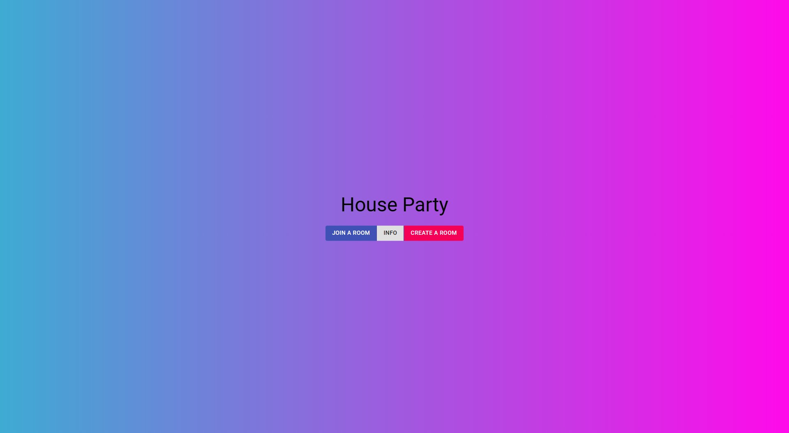

# Music_controller

## 1. Music_controller とは?

SpotifyAPI を使用し、ホストの情報を取得することで、好みの音楽を自分が作成したルームで他人に共有できるアプリです。

## 2. アプリ紹介

### 1. 使用技術

frontend : React

backend : Django REST framework

### 2. Home 画面

ホーム画面では、ルームへの参加、情報の参照、ルームの作成ができます。

### 3. Join 機能

ルームコードを把握し、ルームの参加ができます。

### 4. Create 画面

自分で、ルームを作成できます。

### 5. Play 画面

自分で音楽を流し、他人と共有出来ます。

## 3. 工夫した点

Django Rest frameworkを使ったSpotifyAPIの利用

ReactとDjangoの連携

